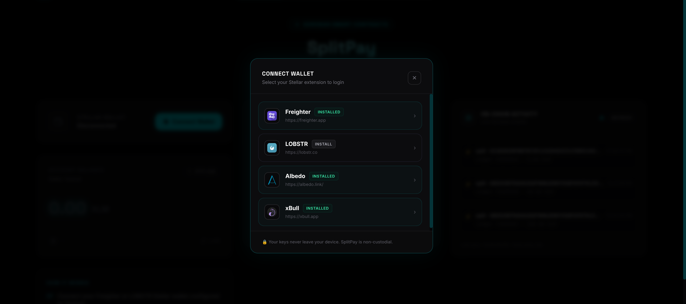
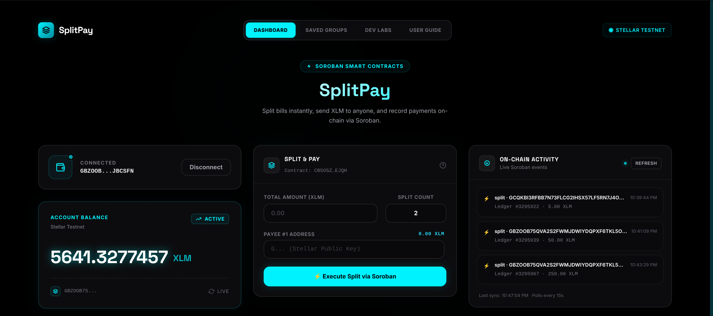
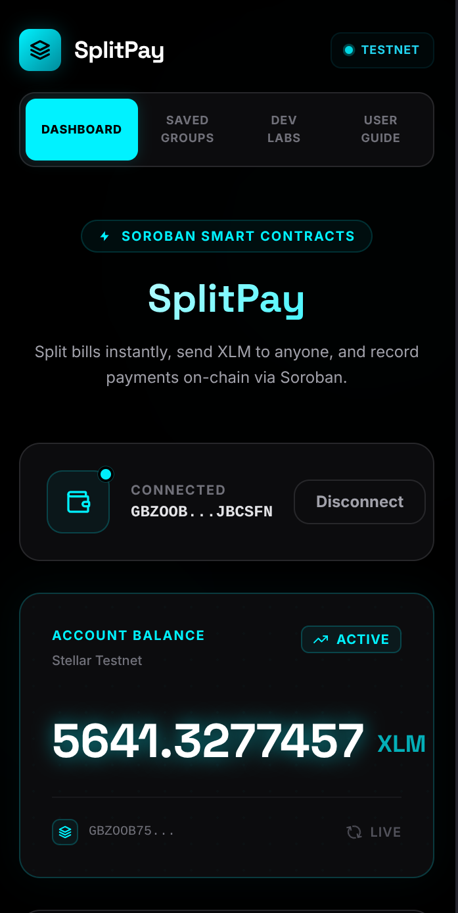
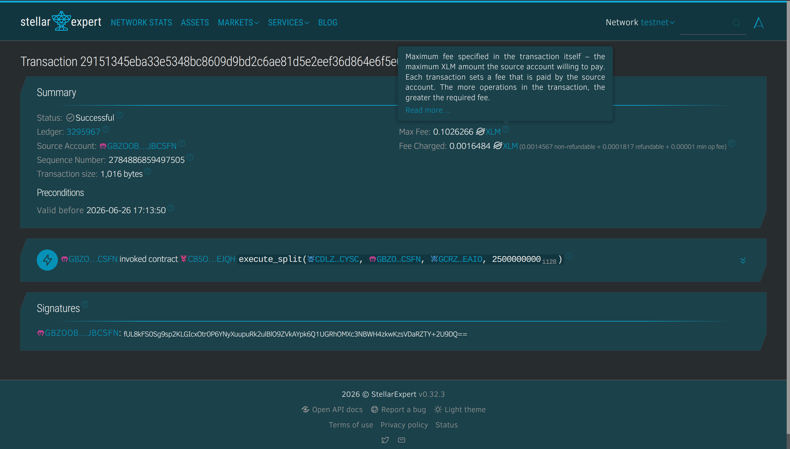
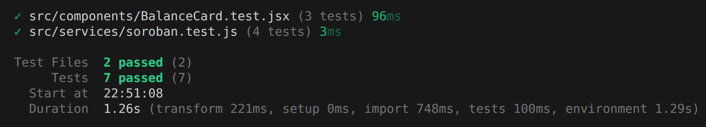
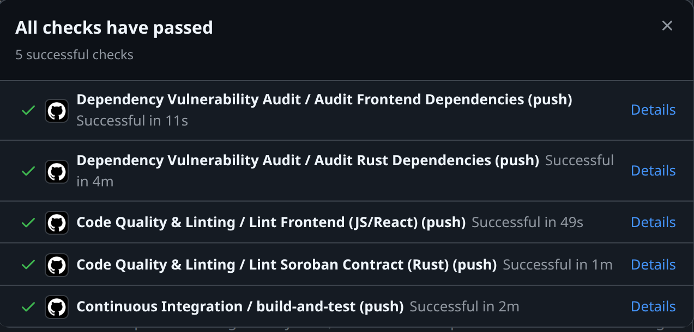

# Split Pay

## Quick Navigation
* [Important Links & Deployed Contracts](#important-links--deployed-contracts)
* [System Architecture](#system-architecture)
* [Core Features & Functionality](#core-features--functionality)
* [Installation & Local Setup](#installation--local-setup)
* [Smart Contract Development & Makefile](#smart-contract-development--makefile)
* [Automated CI/CD Pipelines](#automated-cicd-pipelines)
* [Contributing](#contributing)

---

## Important Links & Deployed Contracts

*   **Live Application URL:** [split-pay-eta.vercel.app](https://split-pay-eta.vercel.app/)
*   **Walkthrough Demo Video:** [demo-video.mp4](./demo-video.mp4)
*   **Soroban Testnet Deployed Contract ID:** `CB5O5ZTTE4OS7R3KLQVUOV7MVN5SA5DJSMHEUZYJ6YCNE3NLPBPAEJQH`
*   **Verified On-Chain Transaction Hash:** `f1ca8ee3a2854935e28586d27ed0eb86b98077c0c1f39e59dfb163a0e5f43c6d`

### Screenshots Gallery
*   **Wallet Options & Modal:** 
*   **Connected Wallet & Live Balance:** 
*   **Mobile Responsive Layout:** 
*   **Successful Testnet Split Execution:** 
*   **Automated Vitest/Rust Unit Test Suites:** 
*   **GitHub Actions CI/CD Pipeline Checks:** 

---


## Core Features & Functionality

### 1. Multi-Wallet Support
*   Detects and interfaces with multiple wallet providers.
*   Gracefully manages wallet disconnection and cache storage to automatically reconnect users on page refresh.

### 2. On-Chain Split Logic
*   Takes a user-specified amount and payees array, calculates the equal split share, and routes the transaction securely in a single atomic operation.
*   Uses contract-to-contract calls to interact directly with the Stellar Asset Contract (SAC) on the Soroban network.

### 3. Real-Time Activity Streaming
*   Continuous background polling fetches all emitted event records from the contract's RPC.
*   Formated values automatically convert raw stroops into user-friendly XLM decimals.
*   State-level deduplication prevents UI flashing and ensures smooth layout updates.

### 4. Dynamic Error Resilience
*   **Wallet Not Installed:** Directs users to the appropriate installation marketplace.
*   **Rejected Transactions:** Catches wallet cancel/rejection signals and updates the UI feedback inline.
*   **Insufficient Balances:** Prevents gas wastage by checking available testnet balances prior to submission.

### 5. Payout Distribution Model (One-to-Many Split)
*   **Flow Direction:** The connected wallet owner acts as the single source payer. The smart contract deducts the calculated split share from the payer's wallet and routes it atomically to each of the payee wallets.
*   **Web3 Signing Constraint:** On-chain transactions cannot pull funds from friends' wallets without their cryptographic signatures. Therefore, the app acts as a **distribution tool** (reimbursing friends or splitting joint payouts) rather than a group pull-payment/merchant aggregator.

---
## System Architecture

Split Pay utilizes a highly decoupled, modern decentralized architecture. The system workflow and architecture are organized as follows:

### 1. Browser Client (Frontend & State)
*   **React Frontend:** Captures payee addresses and XLM amount, handles conversions (XLM to raw Stroops), and manages interface status feedback.
*   **StellarWalletsKit:** Connects to the user's Freighter, Albedo, LOBSTR, or xBull wallet extension to request cryptographic transaction signatures.
*   **localStorage Cache:** Persists connection credentials, active wallet type, contact groups, and event caches locally to preserve user state across refreshes.

### 2. Stellar Soroban Network (On-Chain)
*   **Soroban Testnet RPC:** The gateway used by the frontend to submit signed XDR transactions, query transaction finality, and poll emitted ledger events.
*   **Smart Split Contract:** A WebAssembly-compiled Rust contract that authorizes the sender, divides the payment equally, and routes the transfers.
*   **Native SAC Wrapper:** The native Stellar Asset Contract wrapper that updates token balances on the ledger during transfer operations.

### 3. Outcomes & States
*   **Payee Wallets:** The destination accounts receive their respective split shares.
*   **Ledger Events:** The smart contract emits a `split` event upon execution. The frontend continually polls these events to sync the live On-Chain Activity Feed.

### Components Stack
1.  **Frontend Interface:** Built with React 19, Vite, and Tailwind CSS. Styled using a professional neon-cyberpunk (black and cyan) color scheme optimized for desktop and mobile displays.
2.  **Wallet Gateway:** Integrates the `@creit.tech/stellar-wallets-kit` library to provide support for Freighter, Albedo, LOBSTR, and xBull wallets.
3.  **Rust Smart Contract:** Deployed on the Soroban network. Features atomic loops to divide payments and invoke the native Stellar Asset Contract (SAC) token wrapper for secure balance transfers.

---
## Installation & Local Setup

### Prerequisites
*   [Node.js](https://nodejs.org/) (v22 or newer recommended)
*   [Rust & Cargo](https://www.rust-lang.org/tools/install) (stable release)
*   [Soroban CLI](https://soroban.stellar.org/docs/getting-started/setup#install-the-soroban-cli) (optional, for contract interaction)

### 1. Frontend Local Setup
```bash
# Clone the repository
git clone https://github.com/prasoonk1204/split-pay.git
cd split-pay

# Install project dependencies
npm install

# Setup local environment variables
cp .env.example .env

# Start the Vite development server
npm run dev

# Run the Vitest unit tests
npm run test
```

### 2. Smart Contract Build & Setup
The smart contract resides in the `contracts/split_contract` directory.
```bash
# Navigate to the contract folder
cd contracts/split_contract

# Build the WASM contract binary
cargo build --target wasm32-unknown-unknown --release

# Run Rust unit test suites
cargo test
```

---

## Smart Contract Development & Makefile

We provide a robust `Makefile` in the root directory to streamline contract management operations:

```bash
# Compile and build the WebAssembly binaries
make build

# Optimize the WASM binary size for deployment
make optimize

# Run all contract unit tests
make test

# Deploy the optimized binary to Stellar Testnet
make deploy
```

---

## Automated CI/CD Pipelines

This codebase uses GitHub Actions to run validation checks on every push and pull request to the `main` branch.

1.  **Continuous Integration (`ci.yml`):**
    *   Compiles the smart contract and executes Rust unit tests.
    *   Builds the frontend production bundles and runs the Vitest test suites.
2.  **Code Quality & Linting (`lint.yml`):**
    *   Enforces code styles via ESLint (`npm run lint`).
    *   Checks Rust code formatting (`cargo fmt`) and clippy static analyzer diagnostics.
3.  **Dependency Security Audit (`audit.yml`):**
    *   Runs dependency audits on frontend packages (`npm audit`) and cargo crates (`cargo audit`).
    *   Excludes platform-locked transitive vulnerabilities to ensure stable builds.

To bypass transient network framing issues on runners, the environment variable `CARGO_HTTP_MULTIPLEXING: "false"` is configured globally for all Rust runners.

---

## Contributing

We welcome contributions to Split Pay! Please follow these guidelines:

1.  **Branch Naming:** Use descriptive prefix names (e.g., `feat/feature-name`, `bugfix/issue-name`).
2.  **Code Standards:** Ensure all React code passes `npm run lint` and all Rust code is formatted via `cargo fmt`.
3.  **Tests:** Verify that both frontend unit tests (`npm run test`) and smart contract tests (`make test`) pass successfully before submitting a pull request.
